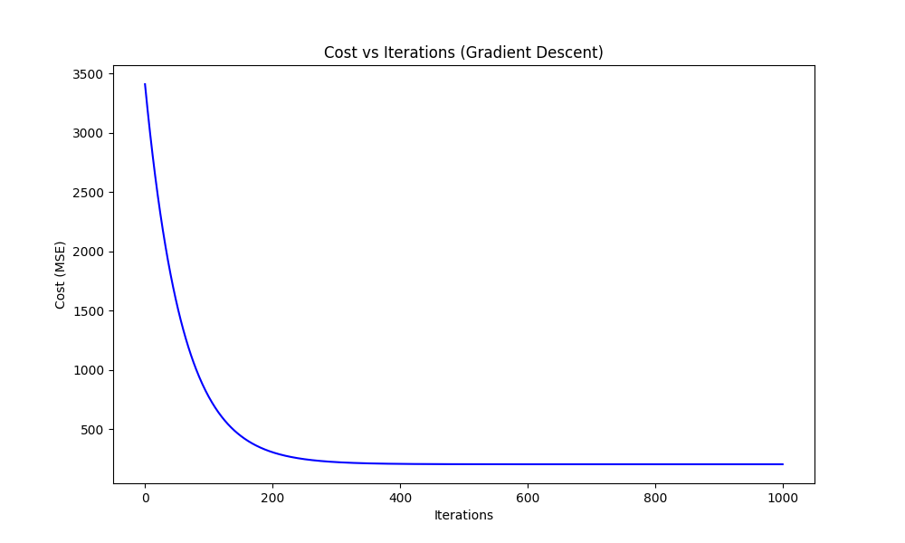
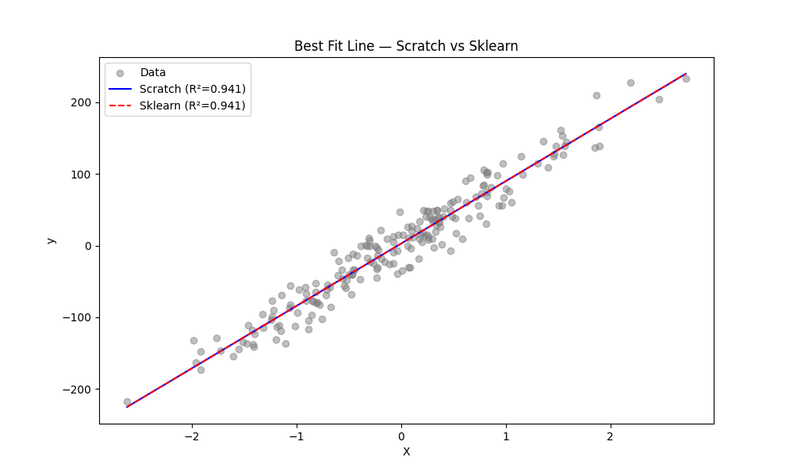
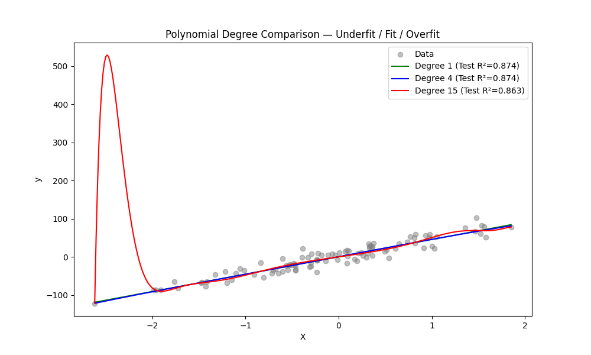
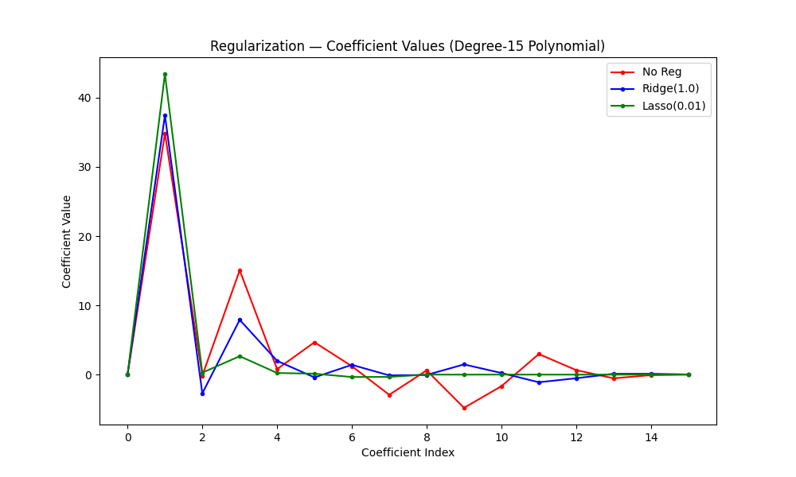

# Linear Regression

## What is it?
Linear Regression finds the best-fit straight line through data by learning two parameters — **intercept** (where the line crosses the y-axis) and **slope** (how steep the line is). It predicts a continuous output value from one or more input features.

**Equation:**
```
y = θ₀ + θ₁x
```
- `θ₀` → intercept (bias term)
- `θ₁` → slope (weight/coefficient)
- For multiple features: `y = θ₀ + θ₁x₁ + θ₂x₂ + ... + θₙxₙ`

---

## Cost Function (MSE)
We measure how wrong our predictions are using **Mean Squared Error**:

```
J(θ) = (1 / 2m) * Σ (ŷᵢ - yᵢ)²
```
- `m` → number of training samples
- `ŷᵢ` → predicted value
- `yᵢ` → actual value
- Goal: minimize J(θ)

---

## Gradient Descent
We minimize the cost function iteratively by updating θ in the direction that reduces cost:

```
θ = θ - α * (1/m) * Xᵀ · (Xθ - y)
```
- `α` (alpha) → learning rate — controls step size
- Too high α → overshooting (cost increases)
- Too low α → very slow convergence

---

## Assumptions Behind Linear Regression
1. **Linearity** — relationship between X and y is linear
2. **Independence** — observations are independent of each other
3. **Homoscedasticity** — constant variance in residuals (no pattern in errors)
4. **Normality** — residuals are normally distributed
5. **No Multicollinearity** — features are not highly correlated with each other (for MLR)

Violating these assumptions → unreliable predictions and misleading coefficients.

---

## Polynomial Regression
When data has a non-linear pattern, we add polynomial features:

```
y = θ₀ + θ₁x + θ₂x² + θ₃x³ + ...
```
Still a linear model (linear in parameters), but fits curved data.

| Degree | Behaviour     | Problem        |
|--------|---------------|----------------|
| 1      | Underfitting  | Too simple     |
| 4      | Good Fit      | Balanced       |
| 15     | Overfitting   | Memorizes data |

---

## Regularization
Regularization penalizes large coefficients to reduce overfitting.

| Type          | Penalty Added to Cost      | Effect                                        |
|---------------|---------------------------|-----------------------------------------------|
| Ridge (L2)    | `λ * Σ θᵢ²`               | Shrinks all coefficients, none become zero    |
| Lasso (L1)    | `λ * Σ |θᵢ|`              | Shrinks coefficients, some become exactly zero|
| ElasticNet    | Mix of L1 + L2            | Combination of both behaviours                |

- `λ` (lambda/alpha) → regularization strength. Higher = more penalty.
- Lasso is useful for **feature selection** (zeros out irrelevant features).
- Ridge is preferred when all features are relevant.

---

## What's Implemented

| Part | Description |
|------|-------------|
| Part 1 | Linear Regression from scratch using NumPy (gradient descent) |
| Part 2 | Sklearn LinearRegression comparison — coefficients and R² |
| Part 3 | Polynomial Regression with degree 1, 4, 15 — train vs test R² |
| Part 4 | Regularization — No Reg vs Ridge(α=1.0) vs Lasso(α=0.01) on degree-15 features |

---

## Results

| Model                        | R² Score |
|------------------------------|----------|
| Linear Regression (Scratch)  | 0.9414   |
| Linear Regression (Sklearn)  | 0.9414   |
| Polynomial Degree 1 (Test)   | 0.8742   |
| Polynomial Degree 4 (Test)   | 0.8735   |
| Polynomial Degree 15 (Test)  | 0.8626   |

Scratch and Sklearn R² match exactly → gradient descent converged correctly.

---

## Plots

### 01 — Cost vs Iterations


Cost steadily decreases and flattens out — gradient descent has converged.

### 02 — Best Fit Line (Scratch vs Sklearn)


Both lines overlap almost perfectly — scratch implementation matches sklearn.

### 03 — Polynomial Degree Comparison


Degree 1 underfits, Degree 4 fits well, Degree 15 starts to overfit (test R² drops).

### 04 — Regularization (Coefficient Shrinkage)


No Reg → large wild coefficients. Ridge → shrinks them smoothly. Lasso → many become zero (sparse solution).

---

## When to Use What

| Situation | Use |
|-----------|-----|
| Linear relationship, few features | Linear Regression |
| Curved relationship | Polynomial Regression |
| Overfitting, all features matter | Ridge |
| Overfitting, need feature selection | Lasso |
| Unknown which features matter | ElasticNet |

---

## Libraries Used
- `numpy` — scratch implementation
- `sklearn` — LinearRegression, Ridge, Lasso, PolynomialFeatures, make_pipeline
- `matplotlib` — all visualizations
